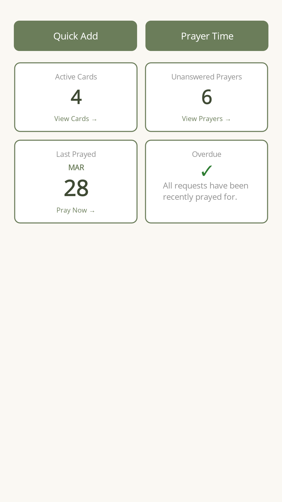
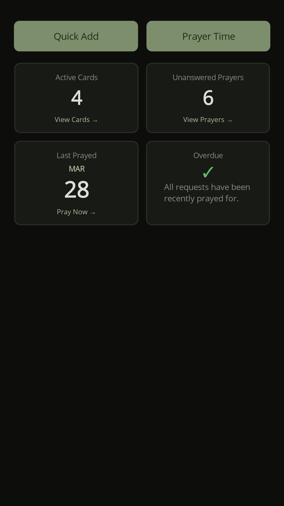

# Practicing Prayer

[](LICENSE.txt)
[](https://github.com/kenmulford/PracticingPrayer/actions/workflows/ci.yml)

A privacy-first prayer journal for iOS and Android. Prayer cards, prayer requests, and a focused "Prayer Time" session — all stored locally on your device. No accounts, no cloud sync, no analytics, no backend.

> **Status:** Active project. Available on Google Play and the App Store · [practicingprayerapp.com](https://practicingprayerapp.com)

<p align="center">
  <a href="https://apps.apple.com/us/app/practicing-prayer/id6760680234"></a>
  &nbsp;
  <a href="https://play.google.com/store/apps/details?id=com.multithreadedllc.prayercards"></a>
</p>

<p align="center">
  
  
</p>

## What it is

Practicing Prayer organizes prayer around three primitives:

- **Prayer cards** — a topic, person, or theme you return to over time
- **Prayer requests** — specific items inside a card, with answered/unanswered state and a date when answered
- **Prayer time** — a focused session that walks through your cards and requests

Everything lives in a local SQLite database. There are no user accounts, no telemetry, and nothing leaves the device unless you explicitly export or share. Tags, colors, and collections exist for personal organization, but the three primitives above are the core loop.

## Privacy

Practicing Prayer is offline-first by design:

- **All data is stored locally** in a SQLite database on the device. No cloud sync, no remote backup.
- **No accounts.** No sign-up, no login, no identity. The app does not know who you are.
- **No telemetry, no analytics.** The app makes no network requests for usage tracking, crash reporting, or any other purpose.
- **No backend.** There is no server-side component to this project.
- **No third-party integrations** with church management or social platforms.
- **Sharing is opt-in.** When you tap "share", the OS share sheet is invoked with a payload you control. The app never shares without your explicit action.
- **Notifications are local.** Prayer reminders are scheduled on-device via the OS notification system; they do not require network access.

## Tech stack

- **.NET MAUI 10** targeting `net10.0-android` and `net10.0-ios`
- **CommunityToolkit.Mvvm** — `ObservableObject` + explicit `SetProperty` / `RelayCommand`
- **CommunityToolkit.Maui** — popups and platform helpers
- **sqlite-net-pcl** — Active Record-style model layer
- **Plugin.LocalNotification** — local prayer reminders
- **xUnit + NSubstitute** — unit tests

## Build and run

You'll need the .NET 10 SDK with the MAUI workloads installed:

```bash
dotnet workload install maui
```

Then, from the repo root:

```bash
# Android (emulator or USB-debugging device)
dotnet build PrayerApp/PrayerApp.csproj -t:Run -f net10.0-android

# iOS (macOS + Xcode required)
dotnet build PrayerApp/PrayerApp.csproj -t:Run -f net10.0-ios
```

Release builds for Android are signed via environment variables — see the `AndroidSigningStorePass` / `AndroidSigningKeyPass` block in `PrayerApp/PrayerApp.csproj`.

## Project layout

```
PrayerApp/              Main app (MAUI)
  Models/               Active Record models (SQLite-backed)
  Services/             Singletons: DBService, PrayerService, etc.
  ViewModels/           MVVM layer (CommunityToolkit.Mvvm)
  Views/                XAML pages + code-behind
  Resources/Styles/     Color tokens and named styles
  Platforms/            Android- and iOS-specific code
PrayerApp.Tests/        xUnit unit tests (links source files from main project)
PrayerApp.UITests/      Appium-based UI tests
docs/                   Plans, research notes, screenshot runbooks
screenshots/            App store screenshots (phone + tablet, light + dark)
```

Architecture, conventions, and known gotchas are documented in [ARCHITECTURE.md](ARCHITECTURE.md).

## Contributing

This started as (and primarily remains) a personal project. Issues and pull requests are welcome, but I make no commitments on response time or scope. If you fork it for your own use, that's exactly what the GPL-3.0 license is for.

## License

[GPL-3.0](LICENSE.txt) © Multithreaded LLC
